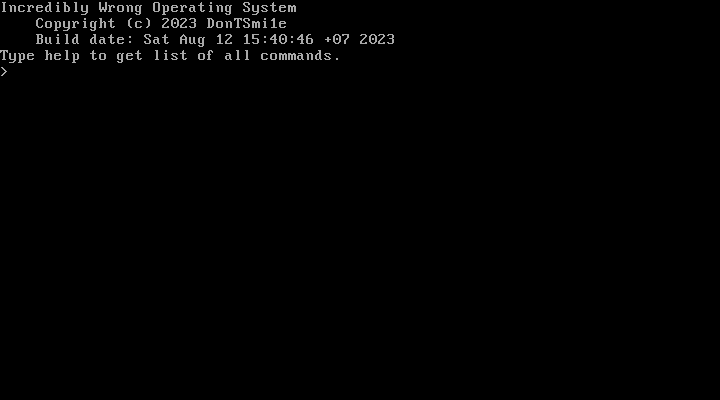

<h1 align="center">Incredibly Wrong OS</h1>

dead project 💀 (no, its not)

Everything is wrong here, even the English here is wrong, because i am stupid russki.


<a href="https://github.com/DonTSmi1e/IWOS/releases" align="center"><h2>Download floppy image</h2></a>
<hr>

## Problems
- IWFS (i wanna fat12, but not today)
- 16-bit mode
- No C/C++
- No kernel API (or something that programs can use to print/load file/etc)

<hr>

## Building
**WSL 2.0 supported**

Requirements:
- NASM
- Make
- QEMU
```bash
make clean      # Delete bin/ and disk.img
make build      # Build project
make run        # Run disk.img in QEMU (qemu-system-i386)

make clean run  # Just build and run OS.
```

<hr>

## Contributing
1. Clone repo
2. Make some changes
3. Edit header of file
4. Make pull request

ez.

<hr>

## Tools
Place useful scripts and programs to `tools` folder.
Like IWFS extractor, yes.

<hr>

## Todo list
- [X] Floppy driver
- [X] Any FS support
- [X] Kernel
- [X] Shell
- [ ] FAT12 support
- [ ] 32-bit mode
- [ ] HDD/USB driver
- [ ] FAT32 support
- [ ] Graphic mode
- [ ] Port NASM (or any supported asm)
- [ ] Self-hosted

## Screenshots


