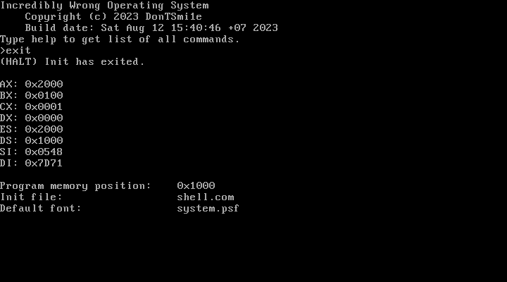
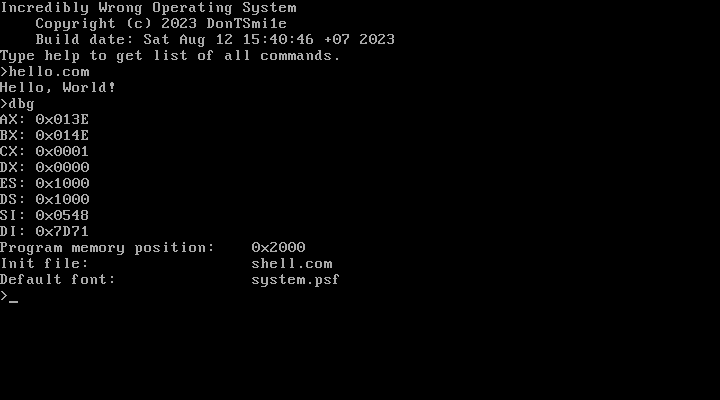

<h1 align="center">Incredibly Wrong OS</h1>

dead project 💀 (no, its not)

Everything is wrong here, even the English here is wrong, because i am stupid russki.


<a href="https://github.com/DonTSmi1e/IWOS/releases">Download floppy image</a>
<hr>

## Used
<a href="https://wiki.osdev.org">OS Development wiki</a>

## User guide
<a href="https://github.com/DonTSmi1e/IWOS/blob/main/USERGUIDE.md">English</a><br>
<a href="https://github.com/DonTSmi1e/IWOS/blob/main/USERGUIDE_RU.md">Русский</a>

## Problems
- Read-only filesystem (i wanna fat12, but not today)

<hr>

## Building
**WSL 2.0 supported**

Requirements:
- NASM <span style="color: #f00;">*</span>
- Python 3 <span style="color: #f00;">*</span>
- QEMU
```bash
./build.bash                                                                            # Clean and build OS

qemu-system-i386 -debugcon file:debug.bin -fda build/output/disk.img                    # Run OS in QEMU

./build.bash && qemu-system-i386 -debugcon file:debug.bin -fda build/output/disk.img    # Clean, build and run OS
```

<hr>

## Contributing
1. Clone repo
2. Make some changes
3. Edit header of file
4. Make pull request

ez.

<hr>

## Tools
Place useful scripts and programs to `tools` folder.
Like IWFS extractor, yes.

<hr>

## Todo list
- [X] Floppy driver
- [X] Any FS support
- [X] Kernel
- [X] Shell
- [ ] FAT12 support
- [ ] Port NASM (or any supported asm)
- [ ] Graphic mode
- [ ] Self-hosted

## Screenshots



