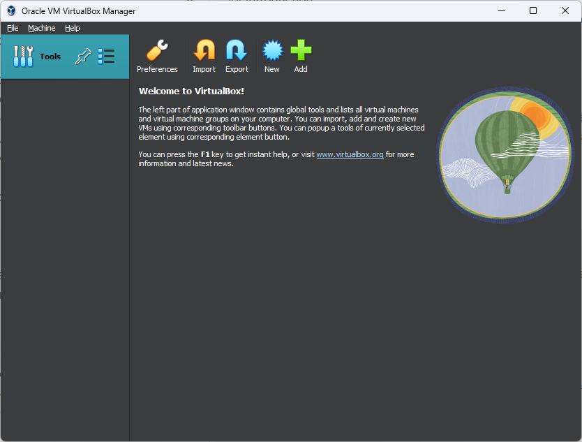
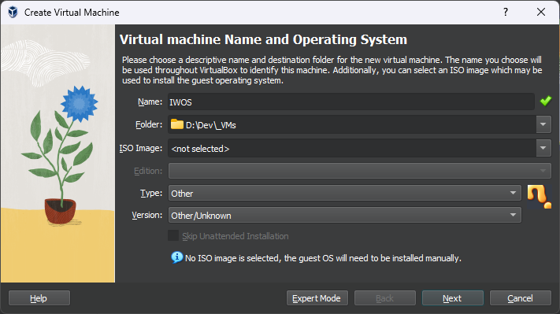
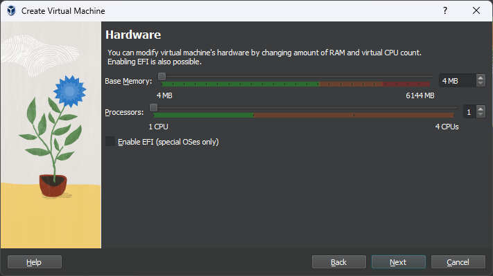
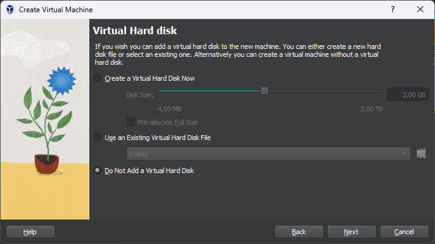
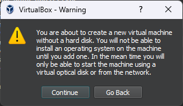
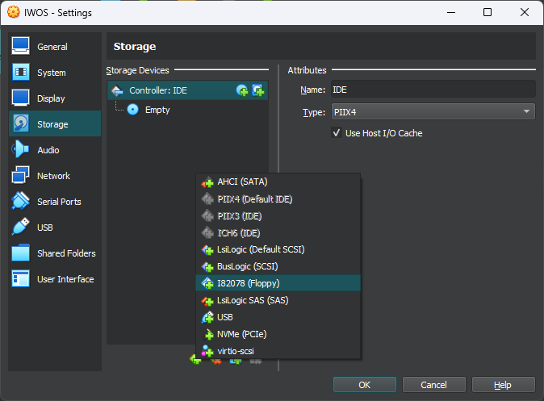
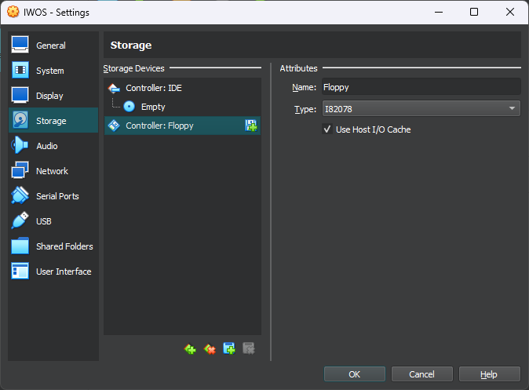
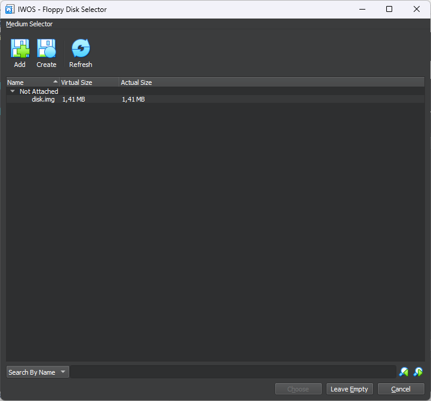
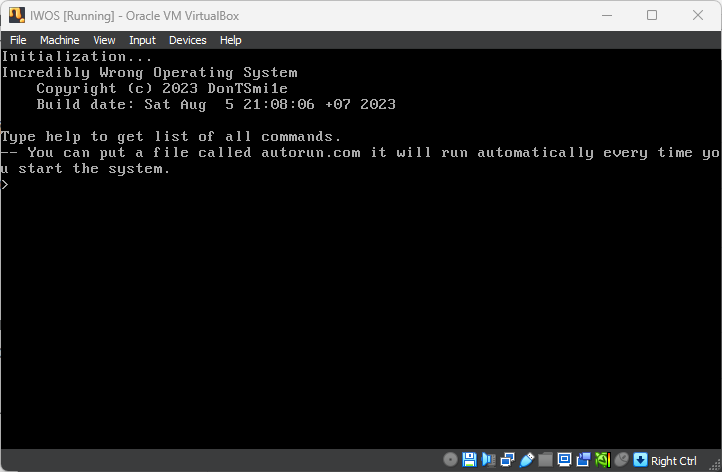

# User guide

## Introduction
I am writing this for friends interested in this, as well as for people who came here "just to look."

First let me fill you in on the details of this guide:
- Everything here will be written in such a way that you already need to know what a virtual machine is, how to work with the terminal, and other small computer things.

Now let's move on to the operating system.

## Installation
### Real computer
**Currently I don't have a working computer with a floppy drive, so OS testing on real hardware is not done.**

### Virtual machine (VirtualBox)
#### Installation
You can download VirtualBox from the official website: https://www.virtualbox.org/wiki/Downloads

I won't describe the installation process, because it's not that difficult, right?



#### Create VM
Click on the "New" button, do not switch to expert mode. Set the values like in the screenshots:





If the program gives a warning about the absence of a hard disk, ignore it.



After creating a new virtual machine, select it from the list and go to "Settings".
In the settings, go to the "Storage" item, add a new I82078 Floppy controller.




Download the latest release of the operating system (namely disk.img file): https://github.com/DonTSmi1e/IWOS/releases

Add a new floppy disk to the controller:



Next, press the Add button, specify the path to the disk.img you downloaded and then press the Choose button.

In the settings window, click OK and start the virtual machine.



Commendable.

## Built-in shell features
The standard shell has two commands: `help` and `dir`.

`help`: displays a list of existing commands.
*Example*
```
Commands: help dir
```

`dir`: lists the files in the root directory of the drive.
*Example*
```
flappybird.com
hello.com
kernel.sys
text.com
```

If you enter a NOT command, then the system will use your input as the filename and attempt to load it. If the file does not exist, you will get an error:
```
File or command not found, type help to get list of commands.
```

I strongly do not recommend running files that are obviously NOT EXECUTABLE.

## Built-in programs (and games!)
`hello.com`: Displays "Hello, World!" to the screen.
`text.com`: Allows you to read the contents of a text file.
`flappybird.com`: A ported clone of Flappy Bird.

## How to write your own files
I wrote a small Python script that can add files to a floppy image: https://github.com/DonTSmi1e/IWOS/blob/main/tools/iwfs.py

Usage:
```bash
# python iwfs.py <path to disk image> <path to file> -D
python iwfs.py disk.img program.bin -D
```
BE SURE TO LEAVE THE -D FLAG OR THE DISK IMAGE MAY BE DAMAGED.

## Development of own programs
**Knowledge of assembly language development required, obviously.**

Required tools:
- NASM
- Python 3

You can use pure interrupts to interact with the kernel, or you can download a library that makes it a little easier.

Here:
https://github.com/DonTSmi1e/IWOS/blob/main/src/programs/iwos.inc
Download this file, place it in some development folder.

Next to the library, create a new file, for example `program.asm`.
Put some simple code there:
```x86asm
[org 0x3000]
[bits 16]

main:
     call clear

     mov si, string
     call print

     ret

%include 'iwos.inc'

string: db 'Hello, World!', NEWLINE, 0
```

Open a terminal and build the program using assembler:
```bash
nasm program.asm -o program.com
```

The program is ready, load it on a floppy disk and start the OS. Enter the `dir` command and make sure everything works.

That's all. To find out all the possibilities that the iwos.inc library gives, open it and read the comments.
