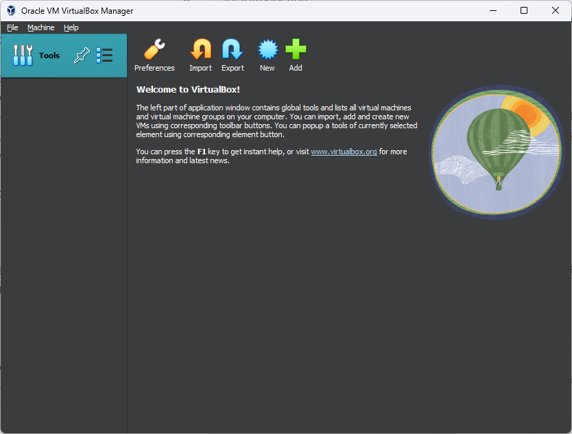
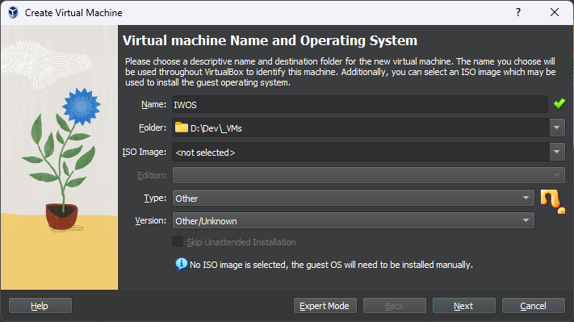
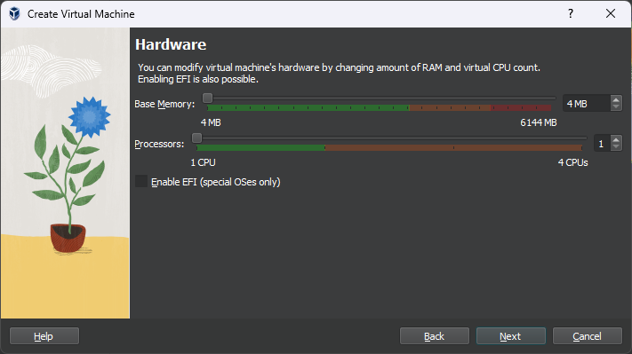
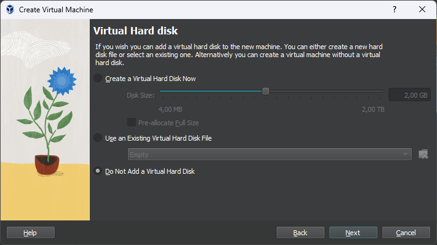
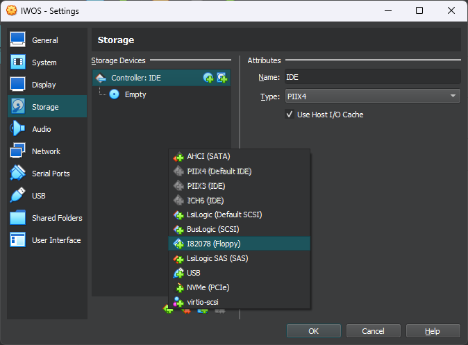
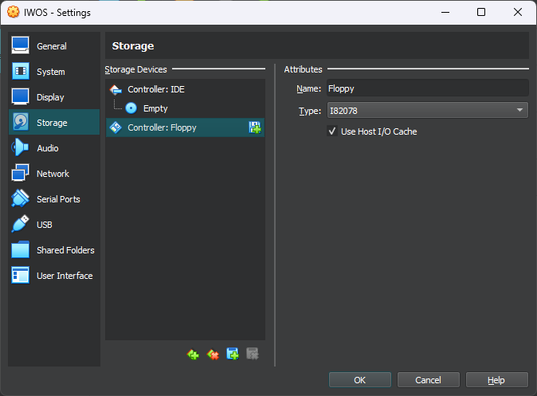
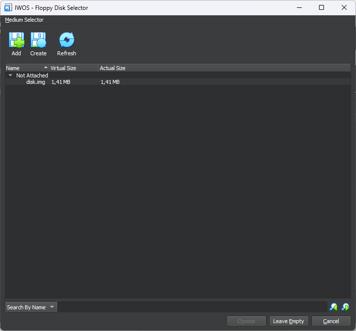
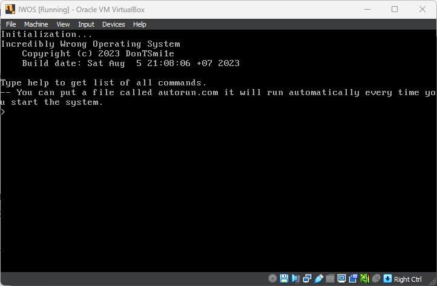

# Руководство пользователя

## Вступление
Пишу это для друзей заинтересованных в этом, а также для людей что зашли сюда "просто посмотреть".

Сперва посвящу тебя в детали этого руководства:
- Все здесь будет написано таким образом, что тебе уже нужно знать что такое виртуальная машина, как работать с терминалом, и прочие мелкие компьютерные вещи.

Теперь перейдем к операционной системе.

## Установка
### Реальный компьютер
**В данный момент у меня нет рабочего компьютера с флоппи приводом, поэтому тестирование ОС на реальном железе не проводится.**

### Виртуальная машина (VirtualBox)
#### Установка
Скачать VirtualBox можно с официального сайта: https://www.virtualbox.org/wiki/Downloads
Я не буду расписывать процесс установки, ведь это не так уж и сложно, верно?


#### Создание ВМ
Нажмите на кнопку "Новый", не переходи в экспертный режим. Установи значения примерно как на скриншотах:




Если программа выдаст предпреждение об отсутствии жесткого диска - проигнорируй его.


После создания новой виртуальной машины, выбери ее из списка и перейди в "Настройки".
В настройках перейди в пункт "Хранилище", добавь новый контроллер I82078 Floppy.



Скачай последний релиз операционной системы (а именно disk.img файл): https://github.com/DonTSmi1e/IWOS/releases

Добавь новый флоппи диск к контроллеру:


Далее нажми кнопку Add, укажи путь до скачанного тобою disk.img и после этого нажми кнопку Choose.

В окне настроек нажми кнопку Ок и запусти виртуальную машину.


Похвально.

## Встроенные возможности оболочки
Стандартная оболочка имеет две команды: `help` и `dir`.

`help`: выводит список существующих команд.
*Пример*
```
Commands: help dir
```

`dir`: выводит список файлов в корневой директории диска.
*Пример*
```
flappybird.com
hello.com
kernel.sys
text.com
```

Если ты ввел НЕ команду, тогда система использует твой ввод как имя файла и попытается загрузить его. Если файл не существует - ты получишь ошибку:
```
File or command not found, type help to get list of commands.
```

Я крайне не рекомендую запускать файлы которые заведомо НЕ ИСПОЛНЯЕМЫЕ.

## Встроенные программы (и игры!)
`hello.com`: Выводит "Hello, World!" на экран.
`text.com`: Позволяет прочитать содержимое текстового файла.
`flappybird.com`: Портированный клон Flappy Bird.

## Как записывать собственные файлы
Я написал небольшой скрипт на Python который может добавлять файлы на образ дискеты: https://github.com/DonTSmi1e/IWOS/blob/main/tools/iwfs.py

Использование:
```bash
# python iwfs.py <path to disk image> <path to file> -D
python iwfs.py disk.img program.bin -D
```
ОБЯЗАТЕЛЬНО ОСТАВЬ ФЛАГ -D, ИНАЧЕ ОБРАЗ ДИСКА МОЖЕТ ПОВРЕДИТЬСЯ.

## Разработка собственных программ
**Необходимы знания разработки на ассемблере, очевидно.**

Требуемые инструменты:
- NASM
- Python 3

Для взаимодействия с ядром ты можешь использовать чистые прерывания или ты можешь скачать библиотеку, которая чуть чуть упрощает этот процесс.

Вот:
https://github.com/DonTSmi1e/IWOS/blob/main/src/programs/iwos.inc
Скачай этот файл, помести в какую нибудь папку для разработки.

Рядом с библиотекой создай новый файл, например `program.asm`.
Помести туда простой код:
```x86asm
[org 0x3000]
[bits 16]

main:
    call clear

    mov si, string
    call print

    ret

%include 'iwos.inc'

string: db 'Hello, World!', NEWLINE, 0
```

Открой терминал и собери программу с помощью ассемблера:
```bash
nasm program.asm -o program.com
```

Программа готова, загрузи ее на дискету и запускай ОС. Введи команду `dir` и убедись что все работает.

На этом все. Чтобы узнать все возможности которые дает библиотека iwos.inc, открой ее и почитай комментарии.